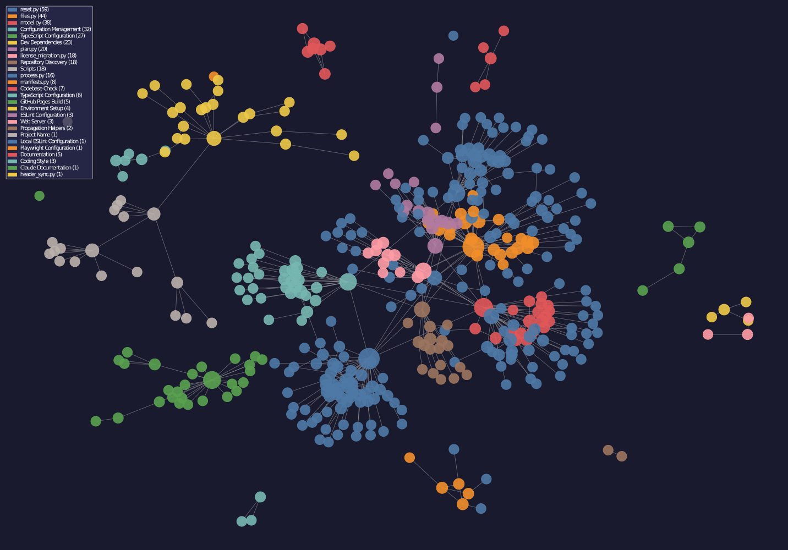

# Repository map

This Graphify snapshot maps 481 symbols and 685 relationships into 30 communities. The illustration keeps the largest 12 communities, scales each circle by membership, and weights each line by cross-community relationships.

## Repository groups

Source paths reveal the main implementation and support areas.

| Group | Symbols | Files | Communities |
| --- | ---: | ---: | ---: |
| `repolib` | 363 | 16 | 15 |
| `templates` | 95 | 11 | 11 |
| `Repository root` | 21 | 6 | 6 |

## Major communities

The largest communities show where related symbols concentrate. Representative files and
well-connected symbols provide useful starting points for source inspection.

| Community | Symbols | Representative files | Connected symbols |
| --- | ---: | --- | --- |
| reset.py | 51 | `repolib/reset.py`, `reset_repo.py` | `reset.py`, `main()`, `dry_run_print()` |
| files.py | 46 | `repolib/files.py` | `files.py`, `read_text()`, `write_text()` |
| model.py | 38 | `repolib/model.py` | `model.py`, `effective_type_chain()`, `find_source_for_bucket()` |
| process.py | 36 | `repolib/process.py`, `repolib/console.py` | `process.py`, `console.py`, `process_repo()` |
| license_migration.py | 36 | `repolib/license_migration.py` | `license_migration.py`, `_migrate_regular_file()`, `_migrate_generic_names()` |
| reset_answers.py | 34 | `repolib/reset_answers.py` | `reset_answers.py`, `answers_from_config()`, `answers_from_interview()` |
| TypeScript Configuration | 27 | `templates/typescript/noexist/tsconfig.json` | `compilerOptions`, `lib`, `include` |
| Dev Dependencies | 23 | `templates/typescript/noexist/package.json` | `devDependencies`, `esbuild`, `eslint` |
| header_sync.py | 22 | `repolib/header_sync.py` | `header_sync.py`, `render_synced_text()`, `compose_insertion()` |
| requirements_sync.py | 20 | `repolib/requirements_sync.py` | `requirements_sync.py`, `render_synced_text()`, `managed_source()` |
| plan.py | 18 | `repolib/plan.py`, `repolib/files.py` | `plan.py`, `compute_propagation_plan()`, `assert_not_meta_file()` |
| Repository Discovery | 18 | `repolib/repo.py` | `repo.py`, `read_repo_type()`, `parse_repo_type_choice()` |

## Graph observations

- `repolib` is the largest source group: 363 symbols across 16 files and 15 communities.
- reset.py is the largest community with 51 symbols (10.6% of the map).
- The strongest cross-community connection is files.py to plan.py, with 7 relationships.
- The graph contains 27 connected community pairs, showing where responsibilities meet across area boundaries.

## Reading the map

The SVG is decorative and deliberately unlabeled. Community names and code-level detail live
in the tables, where they remain readable, searchable, and accessible. Graphify is navigation
evidence; confirm architectural conclusions in the current source and tests.

Regenerate the page and figure with
[devel/graphify_map_repo.py](../devel/graphify_map_repo.py) `--svg` after the map changes.
