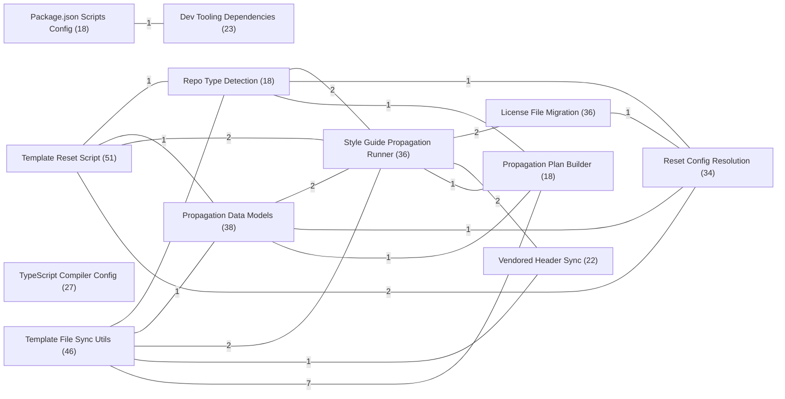

# Repository map

Generated from the Graphify code map by
[devel/graphify_map_repo.py](../devel/graphify_map_repo.py). Rebuild it with `--page`
after the map changes.

## Overview

Each box is a community of related symbols; each line is the number of relationships
crossing between two of them.

## Map summary

| Measure | Value |
| --- | --- |
| Symbols | 452 |
| Relationships | 645 |
| Communities | 26 |
| Symbols in `.py` files | 351 |
| Symbols in `.json` files | 74 |
| Symbols in `.sh` files | 19 |
| Symbols in `.js` files | 4 |
| Symbols in `.toml` files | 1 |
| Token reduction per query | 8.5x |

## Communities

| Community | Symbols |
| --- | --- |
| Template Reset Script | 51 |
| Template File Sync Utils | 46 |
| Propagation Data Models | 38 |
| Style Guide Propagation Runner | 36 |
| License File Migration | 36 |
| Reset Config Resolution | 34 |
| TypeScript Compiler Config | 27 |
| Dev Tooling Dependencies | 23 |
| Vendored Header Sync | 22 |
| Repo Type Detection | 18 |
| Package.json Scripts Config | 18 |
| Propagation Plan Builder | 18 |
| Reset Finish/Git Validation | 16 |
| Gitignore Section Rendering | 14 |
| Propagation Changelog Writer | 14 |
| Manifest Loader | 8 |
| Codebase Check Script | 7 |
| TS Test/Tools Config | 6 |
| Build/Test Shell Scripts | 5 |
| Env Bootstrap Script | 4 |
| ESLint Config | 3 |
| Web Server Runner Script | 3 |
| Propagation Helper Package Init | 2 |
| Project Name Marker | 1 |
| Local ESLint Overrides | 1 |
| Playwright Config | 1 |

## Full graph

Every symbol and relationship at once. Decorative: it shows cluster shape and scale
rather than readable detail.

## Community detail

The most-connected symbols in each community.

### Template Reset Script

51 symbols.

| Symbol | Connections |
| --- | --- |
| `reset.py` | 31 |
| `main()` | 16 |
| `dry_run_print()` | 12 |
| `clean_template_files()` | 9 |
| `git_rm_recursive()` | 8 |
| `git_rm()` | 6 |
| `remove_templates_directory()` | 5 |
| `remove_tracked_meta_directories()` | 5 |

### Template File Sync Utils

46 symbols.

| Symbol | Connections |
| --- | --- |
| `files.py` | 34 |
| `read_text()` | 9 |
| `write_text()` | 7 |
| `_get_template_root()` | 6 |
| `load_gitignore_block()` | 6 |
| `merge_at_imports_safe()` | 6 |
| `_get_deprecated_gitignore_entries()` | 5 |
| `_get_deprecated_test_scripts()` | 5 |

### Propagation Data Models

38 symbols.

| Symbol | Connections |
| --- | --- |
| `model.py` | 27 |
| `effective_type_chain()` | 7 |
| `find_source_for_bucket()` | 5 |
| `overlay_roots_for_type()` | 5 |
| `expand_marker_types()` | 4 |
| `partition_known_types()` | 4 |
| `select_overlay_dirs()` | 4 |
| `shared_rule_ships_to()` | 4 |

### Style Guide Propagation Runner

36 symbols.

| Symbol | Connections |
| --- | --- |
| `process.py` | 17 |
| `console.py` | 12 |
| `process_repo()` | 6 |
| `propagate_style_guides.py` | 6 |
| `PropagateContext` | 5 |
| `apply_file_bucket()` | 4 |
| `main()` | 4 |
| `parse_args()` | 4 |

### License File Migration

36 symbols.

| Symbol | Connections |
| --- | --- |
| `license_migration.py` | 21 |
| `_migrate_regular_file()` | 10 |
| `_migrate_generic_names()` | 7 |
| `_root_path()` | 7 |
| `_migrate_canonical_bodies()` | 6 |
| `_remove_generic_symlink()` | 6 |
| `_identify_generic_license()` | 5 |
| `_migrate_typed_names()` | 5 |

### Reset Config Resolution

34 symbols.

| Symbol | Connections |
| --- | --- |
| `reset_answers.py` | 21 |
| `answers_from_config()` | 10 |
| `answers_from_interview()` | 8 |
| `ResetAnswers` | 5 |
| `resolve_code_license()` | 5 |
| `resolve_docs_license()` | 5 |
| `resolve_licenses()` | 5 |
| `load_config()` | 4 |

### TypeScript Compiler Config

27 symbols.

| Symbol | Connections |
| --- | --- |
| `compilerOptions` | 21 |
| `lib` | 4 |
| `include` | 2 |
| `tsconfig.json` | 2 |
| `**/*.ts` | 1 |
| `dom` | 1 |
| `dom.iterable` | 1 |
| `es2020` | 1 |

### Dev Tooling Dependencies

23 symbols.

| Symbol | Connections |
| --- | --- |
| `devDependencies` | 12 |
| `@eslint/js` | 2 |
| `@playwright/test` | 2 |
| `@types/node` | 2 |
| `esbuild` | 2 |
| `eslint` | 2 |
| `globals` | 2 |
| `playwright` | 2 |

### Vendored Header Sync

22 symbols.

| Symbol | Connections |
| --- | --- |
| `header_sync.py` | 14 |
| `render_synced_text()` | 8 |
| `compose_insertion()` | 5 |
| `sync_vendored_header()` | 5 |
| `compose_replacement()` | 4 |
| `extract_header()` | 4 |
| `find_marker_lines()` | 4 |
| `first_content_index()` | 4 |

### Repo Type Detection

18 symbols.

| Symbol | Connections |
| --- | --- |
| `repo.py` | 15 |
| `read_repo_type()` | 5 |
| `parse_repo_type_choice()` | 4 |
| `expand_choice_piece()` | 3 |
| `resolve_source_dir()` | 3 |
| `write_repo_type_marker()` | 3 |
| `find_repo_root()` | 2 |
| `is_repo_dir()` | 2 |

### Package.json Scripts Config

18 symbols.

| Symbol | Connections |
| --- | --- |
| `scripts` | 9 |
| `package.json` | 7 |
| `allowScripts` | 4 |
| `build` | 1 |
| `check` | 1 |
| `clean` | 1 |
| `esbuild@0.28.1` | 1 |
| `format:write` | 1 |

### Propagation Plan Builder

18 symbols.

| Symbol | Connections |
| --- | --- |
| `plan.py` | 14 |
| `compute_propagation_plan()` | 8 |
| `assert_not_meta_file()` | 6 |
| `is_meta_file()` | 6 |
| `_route_overlay_file()` | 5 |
| `assert_not_meta()` | 5 |
| `resolve_spec_for_type()` | 4 |
| `should_ship_override()` | 4 |

### Reset Finish/Git Validation

16 symbols.

| Symbol | Connections |
| --- | --- |
| `reset_finish.py` | 10 |
| `complete_reset()` | 5 |
| `print_next_steps()` | 4 |
| `report_incomplete_reset()` | 4 |
| `get_git_dir()` | 3 |
| `preflight_finish()` | 3 |
| `verify_clean_end_state()` | 3 |
| `verify_scaffold_sentinel()` | 2 |

### Gitignore Section Rendering

14 symbols.

| Symbol | Connections |
| --- | --- |
| `gitignore.py` | 9 |
| `_is_propagated_gitignore_header()` | 5 |
| `_is_gitignore_local_heading()` | 4 |
| `ensure_gitignore_local_section()` | 4 |
| `extract_gitignore_consumer_lines()` | 4 |
| `managed_gitignore_header()` | 3 |
| `spaced_block()` | 2 |
| `Gitignore rendering helpers for propagated and consumer-owned sections.` | 1 |

### Propagation Changelog Writer

14 symbols.

| Symbol | Connections |
| --- | --- |
| `propagation_changelog.py` | 8 |
| `record_entry()` | 7 |
| `_is_valid_iso_date()` | 4 |
| `_validated_blocks()` | 4 |
| `_insert_entry_in_day()` | 3 |
| `_write_changelog()` | 3 |
| `changelog_path_for_repo()` | 3 |
| `Insert one bullet while preserving every unaffected block byte.` | 1 |

### Manifest Loader

8 symbols.

| Symbol | Connections |
| --- | --- |
| `load_manifests()` | 4 |
| `manifests.py` | 4 |
| `build_repo_type_inherits()` | 3 |
| `build_routing_overrides()` | 3 |
| `Convert raw routing_overrides into the typed model.py structure. Each rule's` | 1 |
| `Load propagation manifests from meta/propagation/manifests.yaml. Reads the YAML` | 1 |
| `Load propagation manifests from the single YAML data file.` | 1 |
| `Validate and return the child -> parent repo_type inheritance map. Every child` | 1 |

### Codebase Check Script

7 symbols.

| Symbol | Connections |
| --- | --- |
| `check_codebase.sh` | 6 |
| `check_codebase.sh script` | 4 |
| `step_run()` | 4 |
| `step_record()` | 3 |
| `step_skip()` | 3 |
| `print_summary()` | 2 |
| `usage()` | 2 |

### TS Test/Tools Config

6 symbols.

| Symbol | Connections |
| --- | --- |
| `include` | 3 |
| `tsconfig.lint.json` | 3 |
| `./tsconfig.json` | 1 |
| `extends` | 1 |
| `tests/**/*.ts` | 1 |
| `tools/**/*.ts` | 1 |

### Build/Test Shell Scripts

5 symbols.

| Symbol | Connections |
| --- | --- |
| `run_playwright_tests.sh script` | 3 |
| `build_github_pages.sh script` | 2 |
| `run_playwright_tests.sh` | 2 |
| `usage()` | 2 |
| `build_github_pages.sh` | 1 |

### Env Bootstrap Script

4 symbols.

| Symbol | Connections |
| --- | --- |
| `source_me.sh` | 3 |
| `PYTHONDONTWRITEBYTECODE` | 1 |
| `PYTHONUNBUFFERED` | 1 |
| `source_me.sh script` | 1 |

### ESLint Config

3 symbols.

| Symbol | Connections |
| --- | --- |
| `eslint.config.js` | 2 |
| `__dirname` | 1 |
| `__filename` | 1 |

### Web Server Runner Script

3 symbols.

| Symbol | Connections |
| --- | --- |
| `run_web_server.sh` | 2 |
| `cleanup()` | 1 |
| `run_web_server.sh script` | 1 |

### Propagation Helper Package Init

2 symbols.

| Symbol | Connections |
| --- | --- |
| `Propagate helper package for distributing canonical docs and styles to consumer` | 1 |
| `__init__.py` | 1 |

### Project Name Marker

1 symbols.

| Symbol | Connections |
| --- | --- |
| `PROJECT_NAME` | 0 |

### Local ESLint Overrides

1 symbols.

| Symbol | Connections |
| --- | --- |
| `eslint.config.local.js` | 0 |

### Playwright Config

1 symbols.

| Symbol | Connections |
| --- | --- |
| `playwright.config.ts` | 0 |
